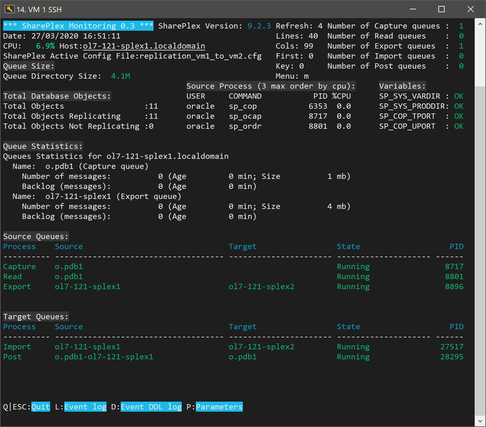

# SharePlex Monitoring Tool

Monitor your SharePlex environment.

## Getting Started

Download files from github (https://github.com/SergioRomera/shareplex_monitoring.git).


### Prerequisites

This shell works only in linux environments.


### Installing

Download code from github.
Modify config.env file if you want to setup target environment.


```
wget https://github.com/SergioRomera/shareplex_monitoring/archive/master.zip
unzip master.zip
cd master*
sh smt.sh
```
## Screenshots




## Versioning

Currnt version is 0.1 (Beta). 

## Authors

* **Sergio ROMERA**


## License

This project is Free for all Quest SharePlex users.

